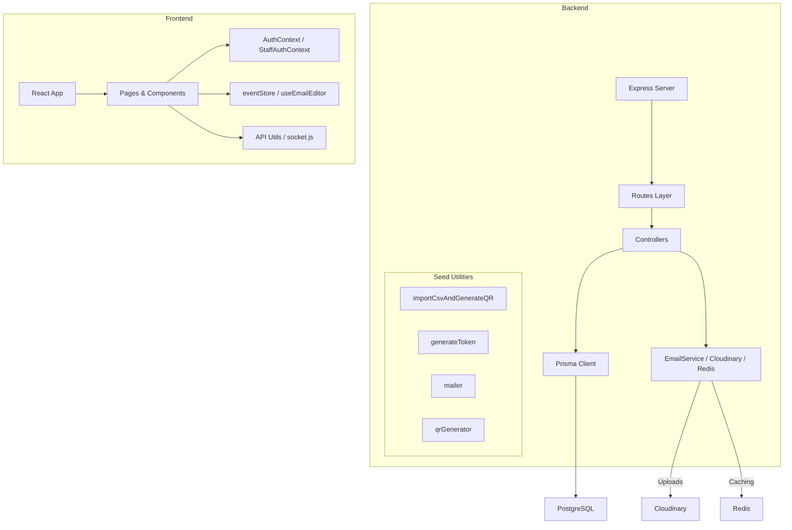
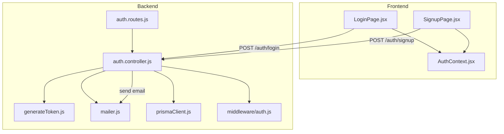
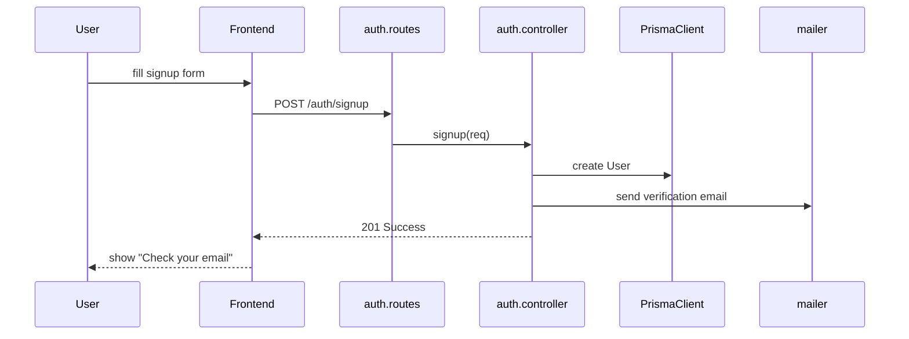
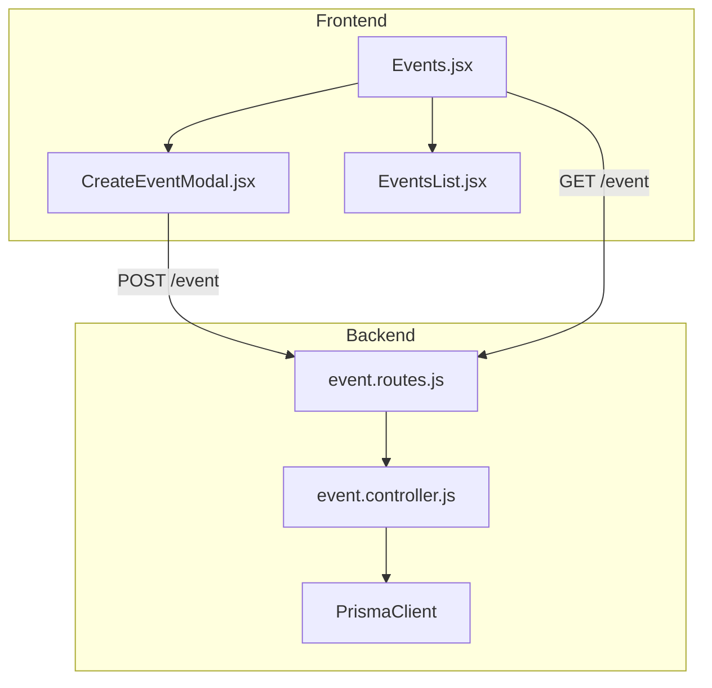

# Project Documentation

## Overview

This project implements a full-stack event management and QR-code scanning system.  
- The **backend** (Node.js + Express + Prisma) offers a REST API, data models, and utilities for authentication, events, participants, checkpoints, and staff management.  
- The **frontend** (React + Vite) provides UIs for organizers, staff scanners, and participants, leveraging contexts, stores, and socket integration.  

Business value: secure event setup, participant onboarding via CSV import + QR generation, real-time check-in/out, analytics dashboards, and email workflows.  

---

## Architecture Overview



---

# Authentication Feature Documentation

## Overview

Users can **sign up**, **log in**, and **verify email**. JWTs guard protected routes via middleware. The feature fits as the gateway for all user-facing and staff-level API access.

## Architecture Overview



## Component Structure

### 1. Presentation Layer

#### **Auth Routes** (`backend/src/routes/auth.routes.js`)
- Registers `/auth` router.
- Binds:
  - POST `/signup` → `authController.signup`
  - POST `/login`  → `authController.login`
  - GET  `/verify/:token` → `authController.verifyEmail`

#### **Auth Controller** (`backend/src/controllers/auth.controller.js`)
- Purpose: handle request logic for sign-up, login, and verification.
- Key Methods:
  - `signup(req, res, next)`
  - `login(req, res, next)`
  - `verifyEmail(req, res, next)`

### 2. Business & Data Access Layers

- **Prisma Client** (`backend/src/prismaClient.js`): single Prisma instance.
- **generateToken** (`backend/src/seed/utils/generateToken.js`): issues JWTs.
- **mailer** (`backend/src/seed/utils/mailer.js`): wraps emailService to send messages.

### 3. Data Models

Defined in `backend/prisma/schema.prisma`:

| Model | Key Fields                        |
|-------|-----------------------------------|
| User  | id, email, passwordHash, role, verified |

### 4. API Integration

#### POST /auth/signup

```api
{
  "title": "User Signup",
  "description": "Register a new user and send verification email",
  "method": "POST",
  "baseUrl": "http://localhost:3000",
  "endpoint": "/auth/signup",
  "headers": [
    { "key": "Content-Type", "value": "application/json", "required": true }
  ],
  "bodyType": "json",
  "requestBody": "{\n  \"email\": \"user@example.com\",\n  \"password\": \"securePass123\"\n}",
  "responses": {
    "201": {
      "description": "User created, verification email sent",
      "body": "{ \"message\": \"Signup successful\" }"
    },
    "400": {
      "description": "Email already in use",
      "body": "{ \"error\": \"Email exists\" }"
    }
  }
}
```

#### POST /auth/login

```api
{
  "title": "User Login",
  "description": "Authenticate user and return JWT",
  "method": "POST",
  "baseUrl": "http://localhost:3000",
  "endpoint": "/auth/login",
  "headers": [
    { "key": "Content-Type", "value": "application/json", "required": true }
  ],
  "bodyType": "json",
  "requestBody": "{\n  \"email\": \"user@example.com\",\n  \"password\": \"securePass123\"\n}",
  "responses": {
    "200": {
      "description": "Login successful",
      "body": "{ \"token\": \"<jwt>\" }"
    },
    "401": {
      "description": "Invalid credentials",
      "body": "{ \"error\": \"Unauthorized\" }"
    }
  }
}
```

#### GET /auth/verify/:token

```api
{
  "title": "Email Verification",
  "description": "Validate user email via token",
  "method": "GET",
  "baseUrl": "http://localhost:3000",
  "endpoint": "/auth/verify/:token",
  "pathParams": [
    { "key": "token", "value": "Verification JWT", "required": true }
  ],
  "bodyType": "none",
  "responses": {
    "200": {
      "description": "Email verified",
      "body": "{ \"message\": \"Email confirmed\" }"
    },
    "400": {
      "description": "Invalid or expired token",
      "body": "{ \"error\": \"Invalid token\" }"
    }
  }
}
```

### 5. Feature Flows

#### 1. Signup Flow



---

# Event Management Feature Documentation

## Overview

Organizers can **create**, **list**, **update**, and **delete** events. Each event ties to participants and checkpoints. Frontend components allow event creation and listing; backend exposes REST endpoints.

## Architecture Overview



### Component Structure

#### **Event Routes** (`backend/src/routes/event.routes.js`)
- Binds:
  - GET `/event`
  - POST `/event`
  - PUT `/event/:id`
  - DELETE `/event/:id`

#### **Event Controller** (`backend/src/controllers/event.controller.js`)
- Key Methods:
  - `getAll(req, res, next)`
  - `create(req, res, next)`
  - `update(req, res, next)`
  - `remove(req, res, next)`

#### **Prisma Model** (`backend/prisma/schema.prisma`)
```prisma
model Event {
  id         Int      @id @default(autoincrement())
  name       String
  startDate  DateTime
  endDate    DateTime
  createdAt  DateTime @default(now())
}
```

### API Integration

#### GET /event

```api
{
  "title": "List Events",
  "description": "Retrieve all events",
  "method": "GET",
  "baseUrl": "http://localhost:3000",
  "endpoint": "/event",
  "headers": [
    { "key": "Authorization", "value": "Bearer <token>", "required": true }
  ],
  "bodyType": "none",
  "responses": {
    "200": {
      "description": "Array of events",
      "body": "[{ \"id\":1, \"name\":\"Launch\", \"startDate\":\"...\" }]"
    }
  }
}
```

#### POST /event

```api
{
  "title": "Create Event",
  "description": "Add a new event",
  "method": "POST",
  "baseUrl": "http://localhost:3000",
  "endpoint": "/event",
  "headers": [
    { "key": "Authorization", "value": "Bearer <token>", "required": true },
    { "key": "Content-Type", "value": "application/json", "required": true }
  ],
  "bodyType": "json",
  "requestBody": "{\n  \"name\": \"Hackathon\",\n  \"startDate\": \"2026-03-01T09:00:00Z\",\n  \"endDate\": \"2026-03-03T18:00:00Z\"\n}",
  "responses": {
    "201": {
      "description": "Event created",
      "body": "{ \"id\": 2, \"name\": \"Hackathon\" }"
    }
  }
}
```

---

# Other Modules & Relationships

Below is a high-level mapping of remaining files and their interactions.

## Backend

- **Checkpoints**  
  - `checkpoint.controller.js` ↔ `checkpoint.routes.js`  
  - Tracks participant check-in/out at event stations.
- **Dashboard**  
  - `dashboard.controller.js`, `new-dashboardController.js` ↔ `dashboard.routes.js`  
  - Aggregates stats for admins.
- **Participants**  
  - `participant.controller.js`, `participant-source.controller.js`, `participants-with-checkpoints.controller.js` ↔ respective routes  
  - Import CSVs (`importCsvAndGenerateQR.js`), generate QR, send emails.
- **Scan**  
  - `scan.controller.js`, `scan.routes.js`  
  - Staff QR scanning logic.
- **Staff**  
  - `staff.controller.js`, `staff.routes.js`  
  - Manage event staff accounts.
- **Status & Validation**  
  - `status.controller.js`, `validate-exit.controller.js`, `status.routes.js`  
  - Manage participant status transitions.
- **Stats**  
  - `stats.controller.js`  
  - Provides numeric metrics.
- **User Management**  
  - `user.controller.js`, `user.routes.js`  
  - Admin user CRUD.

### Middleware

- **Auth** (`backend/src/middleware/auth.js`)  
  - Verifies JWT, attaches user to `req.user`.

### Utilities

- **ExpressError** (`utils/expressError.js`): custom error class.  
- **EmailService** (`utils/emailService.js`, `utils/email.js`): abstracts email sending.  
- **Cloudinary** (`seed/utils/cloudinary.js`): image uploads.  
- **Redis** (`utils/redis.js`): caching layer.  
- **Socket** (`utils/socket.js`): real-time websockets.  
- **Supabase** (`utils/supabase.js`): external storage/integration.

### Prisma & Config

- **Schema & Migrations** (`prisma/schema.prisma`, `migrations/...`)  
- **Client** (`prismaClient.js`), **Config** (`prisma.config.js`)  
- **Lock** (`migration_lock.toml`)

### Server & Scripts

- **Server Entry** (`server.js`): Express setup, middleware, route mounting.  
- **createAdmin.js**: bootstrap script to seed an admin user.  
- **package.json**, **nodemon.json**: dependencies and dev settings.

## Frontend

### Components & Pages

- **Checkpoints**: `CheckpointManager.jsx`, `StaffCheckpointManager.jsx`  
- **Events**: `CreateEventModal.jsx`, `EventsList.jsx`, `Events.jsx` (page)  
- **Participants**: `EmailLogs.jsx`, `EventEmailEditor.jsx`, `MapParticipantSource.jsx`, `ParticipantsList.jsx`, `UploadParticipantSource.jsx`, `ParticipantManager.jsx` (page)  
- **Staff**: `StaffManager.jsx`  
- **Stats**: `CheckpointStats.jsx`, `CheckpointStatsStaff.jsx`  
- **Layouts**: `EventLayout.jsx`, `EventStaffLayout.jsx`, `ScannerLayout.jsx`, `StaffProtectedLayout.jsx`  
- **Auth Modals & Pages**: `LoginModal.jsx`, `LoginPage.jsx`, `SignupPage.jsx`, `VerifyEmailPage.jsx`  
- **Scanner**: `QRScanner.jsx`, `ActiveScanner.jsx`, `ScannerDashboard.jsx`, `ScannerLogin.jsx`  
- **Navigation**: `Navbar.jsx`, `LandingPage.jsx`, `Home.jsx`  

### Context & Store

- **AuthContext.jsx**, **StaffAuthContext.jsx**: manage JWT and user state.  
- **eventStore.js** (Zustand), **useEmailEditor.js**: UI state for email drafts.

### Utilities

- **API wrappers**: `utils/api.js` (organizers), `utils/staffApi.js`  
- **Socket**: `socket.js`  
- **Build & Config**: `index.html`, `vite.config.js`, `package.json`, `vercel.json`, `eslint.config.js`.

---

## Relationships & Data Flow

- **Frontend** pages/components invoke **API utils** → HTTP calls to **Backend routes** → **Controllers** → **Prisma** → **DB** → response back → UI update.  
- Real-time updates (e.g., scan events) use **WebSockets** via `socket.js` on both sides.  
- **Emails** (verification, QR tickets) flow from controllers → emailService → SMTP.  
- **CSV import** triggers seed utilities → writes to DB → generates QR codes → emails participants.

---

This documentation highlights each module’s purpose and how files interconnect across the backend and frontend layers.
